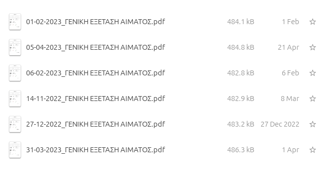
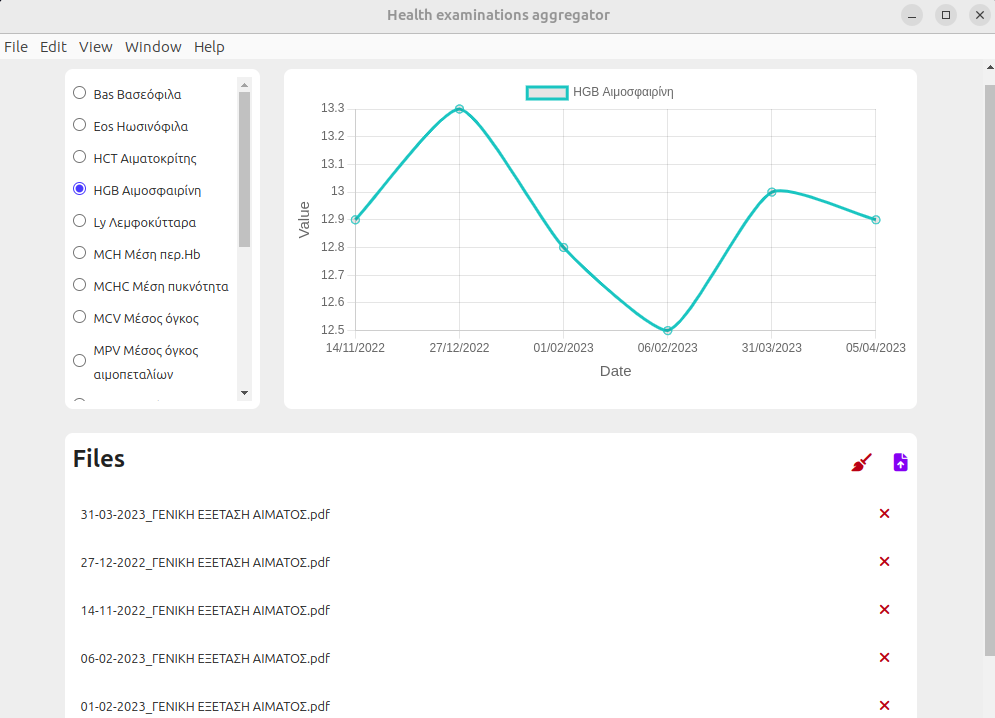

# PAGNI-health-exams-aggregator

This dektop app aims to support patients to track the progress of their blood tests' data across time in an intuitive and usable way.

More specifically, `PAGNI-health-exams-aggregator` app 1. parses multiple blood tests files (PDF format) with a specified format defined from the hospital PAGNI, 2. groups extracted health data by specified health terms (i.e. HCT, HCMC) and 3. visualizes using usable charts the progress of each health term across time.

| PDFs                            | Health agreegator app's UI    |
| ------------------------------- | ----------------------------- |
|  |  |

## Technologies

    
    
    

With the help of [_electron-vite-vue_](https://github.com/electron-vite/electron-vite-vue) project (simple `Electron` + `Vue` + `Vite` boilerplate)
